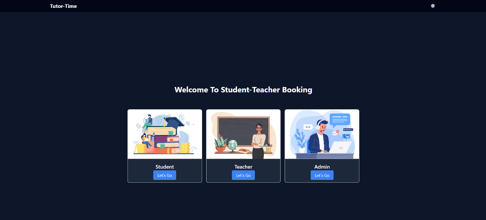
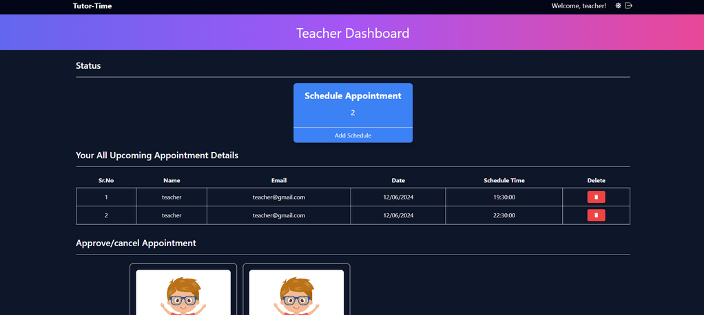
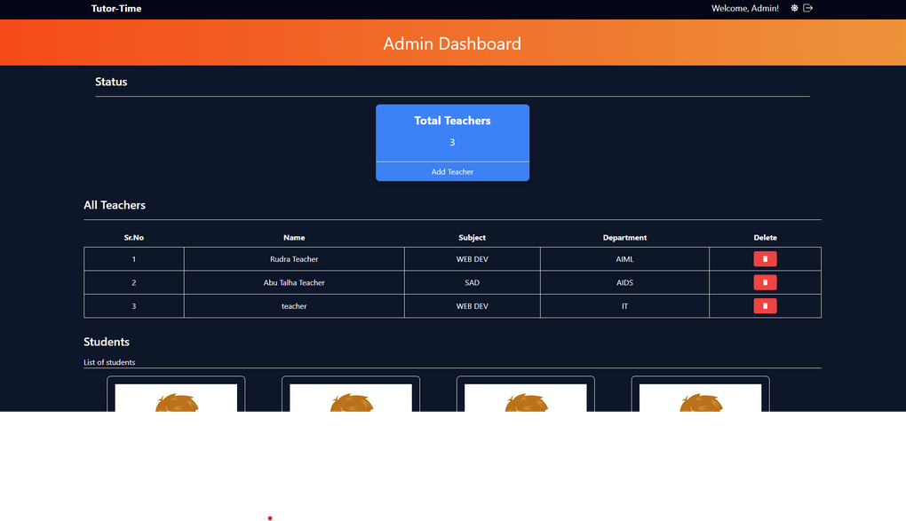

# Student-Teacher Booking Appointment System

This is a MERN stack project designed to facilitate the booking of appointments between students and teachers. The system includes functionalities for admins to manage teachers, for teachers to manage their appointments, and for students to book appointments with teachers.

## Table of Contents

- [Features](#features)
- [System Modules](#system-modules)
  - [Admin](#admin)
  - [Teacher](#teacher)
- [Tech-Stack-Used](#tech-stack-used)
- [Installation](#installation)
- [Usage](#usage)
- [Screenshots](#screenshots)
- [Login Acess](#login)

## Features

- Admin management for adding, updating, and deleting teachers and approving student registrations.
- Teacher functionalities for managing their appointment schedules, approving/cancelling appointments, sending email alerts to students, viewing messages, and viewing all appointments.
- Student functionalities for registering, booking appointments with teachers, sending email alerts to teachers, and sending messages.

## System Modules

### Admin

- Add Teacher (Name, Department, Subject, etc.)
- Update/Delete Teacher
- Approve Registration Student

### Teacher

- Login
- Schedule Appointment
- Approve/Cancel Appointment
- Send Email Alerts to Students
- View Messages
- View All Appointments

### Student

- Register
- Login
- Book Appointment
- Send Email Alert to Teacher
- Send Message

## Tech-Stack-Used

### Frontend


### Backend


### Database


## Installation

To run this project locally, follow these steps:

1. **Clone the repository:**

   ```bash
   git clone https://github.com/rituraj27/StudentTeacher-Booking-Appointment
   ```

2. **Install backend dependencies:**

   ```bash
   cd backend
   npm install
   ```

3. **Install frontend dependencies:**

   ```bash
   cd frontend
   npm install
   ```

4. **Set up environment variables for the backend:**

   Create a `.env` file in the `backend` directory with the following content:

   ```env
   DB_URL=''
   JWT_KEY = ''
   PORT = 5000

   # mail integration

   MAIL_HOST = smtp.gmail.com
   MAIL_USER = 'your_mail'
   MAIL_PASS =
   ```

5. **Run the backend server:**

   ```bash
   cd backend
   npm run dev
   ```

6. **Run the frontend server:**
   ```bash
   cd frontend
   npm run dev
   ```
7. **Set up environment variables for frontend:**

   Create a `.env.local` file in the `frontend` directory with the following content:

   ```env
   VITE_BACKEND_URL='http://localhost:5000'
   ```

The application should now be running on `http://localhost:5173/`.

## Usage

1. **Admin:**

   - Log in to the admin dashboard.
   - Add, update, or delete teachers.
   - Approve student registrations.

2. **Teacher:**

   - Log in to the teacher portal.
   - Schedule, approve, or cancel appointments.
   - Send email alerts to students.
   - View messages and all appointments.

3. **Student:**
   - Register and log in to the student portal.
   - Book appointments with teachers.
   - Send email alerts and messages to teachers.

## Screenshots

Landing Page



Teacher Dashboard



Admin Dashboard



## Login

**Student**

```bash
email: student@gmail.com
Password: pass123
```

**Teacher**

```bash
email: teacher@gmail.com
Password: pass123
```

**Admin**

```bash
email: admin@gmail.com
Password: admin
```
